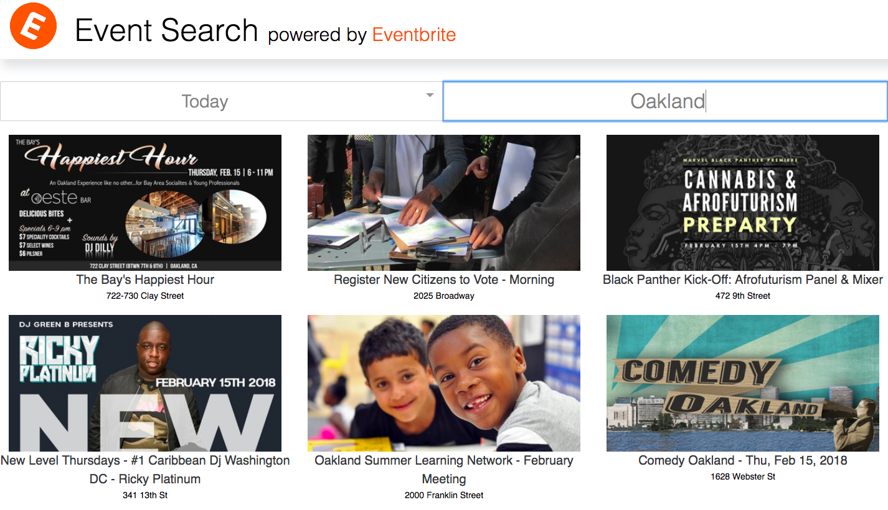
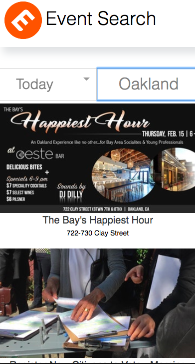

Simple event search tool by city and date built with Eventbrite's API. Bootstraped with create-react-app with addition of SASS and prettier, eslint and husky for formatting. An excercise in time-boxing with 10 hours of work as a parameter. 

## Getting Started
Make sure you have [Node.js](http://nodejs.org/) installed.

```
$ git clone https://github.com/papistan/eventbrite.git # or clone your own fork
$ cd eventbrite
```
Make sure you have [Yarn](https://yarnpkg.com/lang/en/docs/install/) installed.
```
$ yarn install
$ yarn start
```

Stretch goals: 
- rework CSS to be mobile-first
- complete date-time and description flipcard
- add WeekendSearch option to easily search by Sat + Sun
- connect to post API built on Node, Express and MongoDB to save, share and build additional features

- Desktop Screenshot


- Mobile Screenshot

